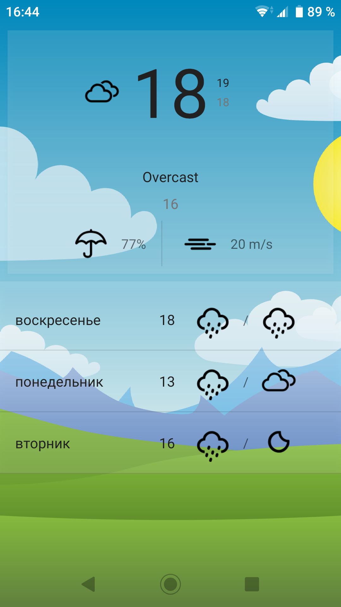
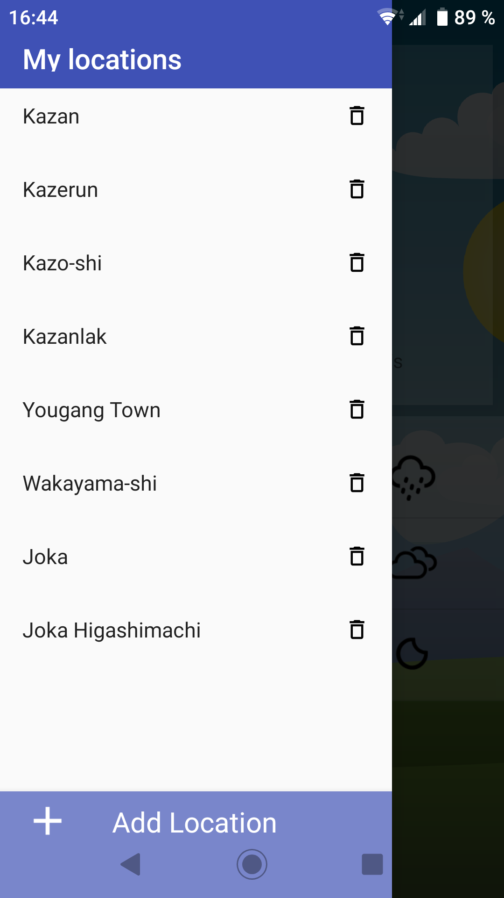

# WeatherApp

Weather applications. Uses AccuWeather open API

### Functionality

The app has one activity with multiple fragments:

* Forecast and current weather

* City search

## Structure 

The app implements MVVM pattern

### Used APIs

* Android Jetpack
* Retrofit 2
* OkHttp
* Android Architecture Components
* Glide
* RxJava
* NavigationUI

## TODO

* Add DI throught Dagger2
* Add junit and espresso tests
* Handle loss of internet connection
